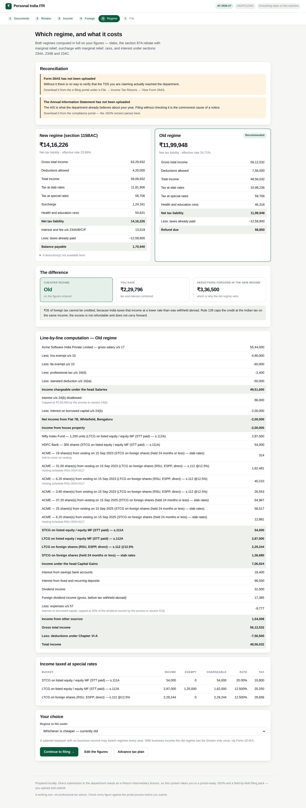
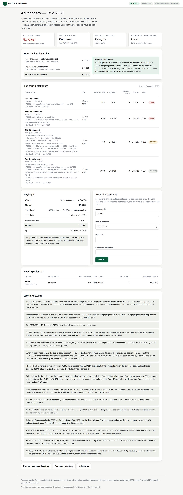

# Personal India ITR

A local web application that prepares an Indian income tax return end to end:
it reads your Form 16, Form 26AS, AIS, broker statements and US stock-plan
exports, reconciles them against one another, computes the tax under both
regimes, picks the right ITR form and produces a portal-ready ITR JSON plus a
field-by-field filing pack.

It handles **US RSUs, ESPP, dividends and dividend reinvestment** properly —
including the three things that trip nearly everyone up: the 24-month holding
period, the calendar-year Schedule FA, and reinvested dividends. A quarterly
vesting schedule is described once and expands into its tranches, and an
**advance-tax planner** works out what to pay each quarter, applying the proviso
to section 234C that most calculators ignore.

Everything runs on your machine. No document is uploaded anywhere.

---

## Where this stops, and why

It stops one click short of submission, and that is a hard limit rather than an
unfinished feature.

Submitting a return through the department's API requires an **e-Return
Intermediary (ERI) licence**. Getting one means being a registered company, LLP
or a certified firm of Chartered Accountants, Advocates or Company Secretaries;
a net worth above ₹1 crore if registering as a company; passing data-security
certification with a due-diligence certificate from an authorised CISA
professional; and holding Type-2 ERI status for the authentication, pre-fill and
submission endpoints. No individual is going to clear that bar for their own
return.

So this system mimics what the department's own **offline utility** does. It
emits a `.json` file in the ITR schema, which you upload at:

> incometax.gov.in → e-File → Income Tax Returns → File Income Tax Return →
> select the assessment year and form → **Offline / Import pre-filled data** →
> upload the JSON

The portal validates the file, shows you a preview, and takes the submission
from there. You get full automation of the hard part — reading documents,
reconciling them and computing the tax — without the corporate compliance hoops.

**One caveat, stated plainly.** The department revises the JSON schema every
assessment year, and the revisions are not always published before the utility
ships. The structure here follows the published schema, but the only honest test
is whether the offline utility imports the file without complaint. Run that test
once before you trust it. If it objects, the field-by-field filing pack contains
every figure mapped to its portal location, so you can type the return in and
the computation is identical either way.

---

## What it does

**Reads your documents.** Drop the whole folder in at once — nothing needs
labelling. Each file is identified, parsed and scored for confidence.

| Document | Formats | What comes out |
|---|---|---|
| Form 16 | PDF | Employer, TAN, the 17(1)/17(2)/17(3) split, section 10 exemptions, professional tax, TDS, Chapter VI-A the employer allowed |
| Form 26AS | PDF | Every TDS, TCS and challan row, by deductor |
| AIS / TIS | JSON, PDF | Salary, interest, dividend, rent, securities sales, by information category |
| Bank interest certificates | PDF | Savings and deposit interest kept separate — only savings interest qualifies for 80TTA |
| Broker capital gains | XLSX, XLS, CSV | Every transaction, bucketed by asset type and holding period |
| US stock plan and brokerage | XLSX, XLS, CSV | Vesting tranches, **ESPP purchases**, dividends with record dates and per-share rates, reinvestment, disposals — from E*TRADE, Fidelity, Schwab and Morgan Stanley StockPlan Connect |

Zerodha Console, Groww, Upstox, Kuvera, CAMS and KFintech all use different
column headings for the same six numbers, so headings are mapped onto a
canonical set rather than maintaining a parser per broker.

**Reconciles them against each other.** Three mismatches cause almost every
notice under section 143(1)(a), and all three are checked before you file:

- TDS you are claiming that Form 26AS does not show — this gets disallowed
- Income the AIS reports that your return omits
- Securities sales in the AIS with no matching capital gain

**Computes the tax properly.** Both regimes, in full:

- Slab tax by age band, section 87A **with marginal relief**, surcharge **with
  marginal relief** and the 15% cap on capital-gains surcharge, cess
- Capital gains under the post-23-July-2024 regime — 111A at 20%, 112A at 12.5%
  above ₹1.25 lakh, 112 at 12.5%, with the grandfathered
  20%-with-indexation option on pre-cutoff property where it works out cheaper
- Section 112A grandfathering using the 31 January 2018 fair market value
- Loss set-off under sections 70, 71 and 74, against the highest-taxed bucket
  first, with carry-forward
- The unused basic exemption set against capital gains for residents, as the
  provisos to sections 111A, 112 and 112A permit
- Chapter VI-A with every statutory ceiling, and the aggregate limited by
  section 80A(2) — deductions never touch special-rate income
- Interest under sections 234A, 234B and 234C, and the section 234F fee, with
  the section 207(2) exemption for senior citizens without business income
- Section 234C computed with its first proviso, so capital gains and dividends
  are not charged interest for the instalments that fell due before they arose

### US RSUs, ESPP and dividends

Foreign equity is not one taxable event but three, and collapsing them is where
returns go wrong.

**Vesting is salary.** The same section 17(2)(vi) that catches the ESPP discount
taxes the fair market value on the
vesting date as a perquisite at slab rates. Section 49(2AA) then makes that same
value the cost basis on sale, which is what stops it being taxed twice. Your
employer normally runs it through payroll, so it is already inside the Form 16 —
each vest carries a tick-box for that, and the reconciler queries a vest with no
matching section 17(2) figure.

**The holding period is 24 months, not 12.** Sections 111A and 112A require
securities transaction tax, which is never paid on a NYSE or NASDAQ trade. So a
US share is not "listed" for this purpose however obviously listed it looks: it
turns long term only at 24 months, and there is no ₹1.25 lakh shelter. Selling
at 18 months means slab rates — up to 30% plus surcharge — rather than 12.5%.
On a decent tranche that is lakhs. The interface shows the exact date each lot
crosses over.

**Dividends follow the position, not the paperwork.** Entitlement is fixed on
the *record date*, and a holding that grows every quarter as tranches vest, as
ESPP shares are bought and as dividends are reinvested held a different number of
shares on each one. Enter the declared rate per share once and each payment is
sized from the lot ledger — the same ledger the capital-gains matching uses, so
the position is the real one:

| Paid | Held on record date | Rate | Gross |
|---|---|---|---|
| 20 Aug | 100 — the June tranche | $0.72 | $72.00 |
| 20 Nov | 200 — and September's | $0.75 | $150.00 |
| 20 Feb | 250 — and the December ESPP purchase | $0.70 | $175.00 |

A payment you entered by hand, or imported from a 1099-DIV, always wins; the
schedule fills gaps rather than overwriting. And where a rate per share is known,
the declared amount is checked back against the ledger: a dividend implying 500
shares when 100 were held means a vesting tranche or a purchase is missing. A
holding that paid nothing all year is queried too, because the AIS will have the
payment even when the return does not.

**Indian dividends** are the same income under different plumbing — no
conversion, no foreign credit, and TDS at 10% under section 194 once a payer
crosses ₹10,000 in the year, a threshold the Finance Act 2025 raised from
₹5,000. That TDS becomes an ordinary tax credit, and a large dividend recorded
without it is flagged, since unclaimed TDS is a refund forgone. Recording the
payment date matters for more than tidiness: it is what earns the section 234C
relief described below.

**Interest on money borrowed to buy the shares** is deductible against dividend
income under the proviso to section 57(i), but only up to **20% of that income**,
and nothing else is deductible at all — not demat charges, not advisory fees.
Enter what you paid and the cap is applied. It survives in both regimes; section
115BAC restricts only clause (iia), the family-pension deduction.

**Reinvested dividends are income now.** A dividend is taxable on the payment
date whether it reaches your bank or buys more shares, and it is taxed on the
**gross**, before the 25% the US withholds. What reinvestment does change is the
cost basis: every reinvestment is a fresh lot with its own acquisition date and
its own 24-month clock. Quarterly reinvestment over three years leaves twelve
small lots, most still short term when the position is finally sold — which is
why a position you have "held for years" throws off short-term gains nobody
expected. Each lot is tracked separately and matched first in, first out.

**Rule 115 picks the exchange rate, and you do not.** Every amount converts at
the SBI telegraphic transfer buying rate on the *last day of the month before*
the transaction. A vest on 15 September uses the 31 August rate; three tranches
in March, June and September use three different rates. A built-in table gets
you computing immediately, but every rate in it is flagged provisional and the
Foreign income page lists exactly which months you relied on so you can replace
them with the published figures.

**The foreign tax credit is capped.** Rule 128(2) allows the lower of the tax
paid abroad and the Indian tax attributable to that same income — the excess is
neither refunded nor carried forward, and the system says how much was lost and
why. Withholding above the 25% the India-US treaty permits is not creditable
here at all, which usually means a lapsed Form W-8BEN. Rule 128(9) wants
**Form 67 filed before the return**; claiming credit without it is reported as a
blocking error, because CPC denies it first and makes you appeal afterwards.

**Schedule FA is the one with a ₹10 lakh penalty.** It reports the **calendar**
year — 1 January to 31 December 2025 for AY 2026-27 — not the financial year, so
a February 2026 vest is this year's salary but next year's Schedule FA. There is
no minimum value and no income requirement: a resident and ordinarily resident
must report every foreign asset held at any point in that year. Omitting one
attracts a flat ₹10 lakh under sections 42 and 43 of the Black Money Act,
charged on the non-disclosure itself, so it applies just as fully when the tax
was paid correctly. Table A2 (the custodial account) and Table A3 (the shares)
are both generated, and a missing entity address is flagged before the portal
rejects it.

### ESPP: the discount, and the basis trap

An Employee Stock Purchase Plan takes payroll deductions over an offering period
and buys shares at a discount. Two consequences follow, and the second is where
money quietly goes missing.

**The discount is salary.** Section 17(2)(vi) taxes the gap between the fair
market value on the purchase date and what you actually paid, at slab rates,
with TDS under section 192 in the month of purchase. Your own contributions are
not deductible against it — they came out of salary that was already taxed.

**The cost basis on sale is the fair market value, not the price you paid.**
Section 49(2AA) fixes the cost at the amount already brought to tax as a
perquisite. Your broker's statement and any US 1099-B both report the discounted
purchase price, because that is correct for US tax and wrong for Indian tax.
Copying it across taxes the discount twice — once as salary in the year of
purchase, once as capital gain on sale.

The error is not small, because of the lookback. A standard plan buys at 85% of
the *lower* of the offering-start price and the purchase-date price, so when the
share price has risen the real discount is far more than the headline 15%:

| | |
|---|---|
| Offering start, 1 Jun | $150 |
| Purchase date, 1 Dec — market | $200 |
| Purchase date — what you paid | $127.50 (85% of the lower) |
| **Effective discount** | **36.25%**, not 15% |
| Perquisite taxed as salary | ₹6,38,000 |
| Cost basis on sale, s.49(2AA) | **₹17,60,000** |
| What the 1099-B would show | ₹11,22,000 |

Sell at $210 and the gain is ₹88,000. Take the basis off the 1099-B instead and
it becomes ₹7,26,000 — ₹6,38,000 too much, which is exactly the perquisite,
taxed a second time. The interface shows both figures side by side so the
difference is visible rather than implied, and ESPP lots are matched FIFO
alongside RSU tranches and reinvestment lots.

One honest caveat: fair market value for a share not listed on a *recognised*
(Indian) stock exchange is, strictly, a Category I merchant banker's valuation
under Rule 3(8), not the NYSE closing price. In practice employers use the
market price and report it in Form 16. Use whatever figure your Form 16 uses, so
the return and the TDS agree.

### Quarterly vesting, and advance tax

**A grant is described once.** A four-year grant vesting quarterly is sixteen
separate salary events, each at its own price, its own Rule 115 exchange rate
and its own 24-month clock. Give the system the grant, the frequency, the first
vest date and any cliff, and it generates the tranches — clamping to the month
end, so a grant vesting on the 31st vests on 28 February rather than rolling
into March and landing in a different quarter. Tranches add back to the grant
exactly; rounding never loses or invents a share.

Tranches with a real price go into the return. Tranches still to come are
**projections**: they are valued at your estimate, used to size the advance-tax
instalments, and never allowed anywhere near the return or the ITR JSON. A vest
you entered by hand always beats the generated one.

**The advance-tax planner is where the ₹234C proviso earns its keep.** Section
211 wants 15% by 15 June, 45% by 15 September, 75% by 15 December and the whole
of it by 15 March, and section 234C charges 1% a month on any shortfall. Applied
naively that is punitive for anyone with capital gains, because it demands tax
in June on a gain made in December.

The **first proviso to section 234C(1)** says otherwise. Where the shortfall is
down to capital gains, dividends, winnings, or business income in its first
year, no interest arises for the earlier instalments — *provided* the whole of
the tax on that income is paid in the remaining ones, or by 31 March where the
income arose after 15 March.

So the planner splits your liability in two:

| | Follows | Because |
|---|---|---|
| Salary, interest, rent | 15 / 45 / 75 / 100 | Foreseeable from April |
| **Capital gains and dividends** | Full tax, from the quarter it arose | The proviso |

The trade is worth understanding: relief on the earlier instalments is bought by
owing the *entire* tax on that income at the very next one, not a fraction of
it. Miss that instalment and the relief goes with it. The planner shows both the
interest actually chargeable and the net saving against a naive calculation.

It also shows, per quarter, which vests and which sales fell in that window,
what was required, what was paid, what is short and what that costs — with the
challan details for the payment (ITNS 280, minor head 100) and somewhere to log
the BSR code and serial number afterwards, so the next quarter accounts for it
and the figures are ready for the return.

**Picks the form and explains why.** ITR-1 versus ITR-2 versus ITR-4, with every
disqualification listed. Filing the wrong form makes a return defective under
section 139(9), so the selector escalates when in doubt.

**Produces the output.** ITR-1 and ITR-2 JSON, a computation-sheet PDF worth
keeping for the next few years, and a filing pack mapping every figure to its
portal field.

---

## Seeing it with data in it

```bash
python demo/seed_demo.py          # one fictional taxpayer, two scenarios
python run.py
```

That creates two returns for AY 2026-27 belonging to an invented Bengaluru
engineer with a US employer's equity — a four-year grant vesting quarterly, an
ESPP purchase with a lookback, dividends part-reinvested, a couple of sales, an
Indian dividend, a home loan and the usual deductions. One is the finished
return; the other is the same year still in progress, seen from December, where
salary TDS covers the salary and the gains fall to advance tax. Nothing in it is
real: no genuine PAN, TAN, IFSC or account number appears anywhere.

`demo/capture.py` drives the running application with a real browser and writes
a screenshot of each screen to `demo/screens/`, which is how the images in this
file were made and a quick way to eyeball the interface after a change.





## Installing and running

Python 3.10 or newer.

```bash
git clone <this repository>
cd Personal_india_itr

python3 -m venv .venv
source .venv/bin/activate          # Windows: .venv\Scripts\activate
pip install -r requirements.txt

python run.py
```

It opens at <http://127.0.0.1:8000>, bound to localhost only — your Form 16 has
no business being reachable from the network.

```bash
python run.py --port 9000          # a different port
python run.py --reload             # reload on code changes
python run.py --no-browser         # do not open a browser
```

Returns live in a SQLite file at `~/.india-itr/returns.db`. Override with
`ITR_DATA_DIR`.

---

## Using it

The wizard is five steps.

**1 · Documents.** Upload everything. Password-protected AIS and 26AS PDFs are
opened automatically using the department's convention — PAN in lower case
followed by date of birth as `DDMMYYYY`, so `abcde1234f01011990`. If nothing has
been read yet, fill your PAN and date of birth in on the Income page first.

**2 · Review.** Every extracted figure, with a confidence bar and the raw text
it came from. Nothing has touched the return yet. Untick whatever looks wrong.
Where Form 16 and Form 26AS disagree on TDS, the default is to trust 26AS, since
that is the statement the department matches your claim against.

**4 · Foreign.** Vesting schedules, individual vests, dividends, sales,
exchange rates and Schedule FA.

**3 · Income.** Everything read from your documents, pre-filled and editable,
plus what the documents did not cover. Enter deductions as what you actually
invested — the ceilings are applied for you.

**5 · Regime.** Both regimes side by side, line by line, with reconciliation
findings. It recommends one; you can override it.

**Advance tax** sits outside the wizard, because it looks forward at the year
in progress rather than back at the one being filed. It is reachable from the
Foreign, Regime and File screens.

**6 · File.** The chosen ITR form with reasons, the JSON, the computation PDF,
the filing pack, and an ordered checklist — including paying self-assessment tax
*before* generating the final JSON if there is a balance, and e-verifying within
30 days, without which the return is treated as never filed.

---

## Correctness

The tax engine has 138 golden tests whose expected values were worked out by hand
from the statute rather than generated by running the code — a test that records
current behaviour merely freezes bugs in place. They cover every new-regime slab
boundary, 87A and its marginal relief, surcharge marginal relief at the ₹50 lakh
threshold, the capital-gains buckets, loss set-off ordering, the Chapter VI-A
ceilings and the interest sections.

```bash
pytest tests/ -q          # 234 tests
```

Two invariants worth knowing about, because they are easy to get wrong:

- The **₹1.25 lakh under section 112A is a rate threshold, not a deduction**.
  The full gain stays in total income, where it counts towards the 87A ceiling
  and the surcharge thresholds. Treating it as a deduction understates total
  income and silently changes the answer.
- **Money is `Decimal` everywhere.** A 0.005 float drift is the difference
  between a return that matches the department's computation and one that
  attracts a demand notice.
- **A US share is not a listed share.** Sections 111A and 112A need securities
  transaction tax. Foreign equity therefore takes 24 months to turn long term
  and gets no ₹1.25 lakh exemption — applying the Indian equity rules to it
  understates the tax badly.
- **Schedule FA is on the calendar year.** Nothing else in the return is, so the
  figures deliberately do not tie to the rest of it.
- **Section 234C has a proviso.** Charging capital gains as though they should
  have been foreseen in April is the commonest advance-tax error, and it always
  errs against the taxpayer.
- **A projection is not a figure.** Tranches that have not vested exist to size
  an instalment. They are barred from the return and from the ITR JSON, and
  there is a test that says so.
- **An ESPP cost basis is the fair market value.** The 1099-B disagrees, and the
  1099-B is right about US tax and wrong about this one.
- **A dividend is sized by the record date.** Not the pay date, and not the
  position held today.
- **A dated dividend earns the section 234C relief; an undated one cannot.**
  Where no date is known the earliest instalment is assumed, which errs against
  the taxpayer rather than understating the liability.

---

## What it does not do

- **Submit the return.** See above.
- **ITR-3** — business income with regular books of account. The computation and
  filing pack still work; only JSON generation is absent.
- **ITR-4 JSON** — presumptive income under 44AD, 44ADA and 44AE is computed and
  appears in the filing pack, but the JSON is not generated yet.
- **Non-resident taxation**, and relief under section 89 for salary arrears.
  Section 90 relief on foreign income *is* computed; section 91 relief, for
  countries India has no treaty with, is not.
- **ESOPs with deferred taxation** under section 191(2) for eligible start-ups.
- **Disqualifying dispositions** and other US-side ESPP concepts. They change
  the US tax treatment; they have no bearing on the Indian computation, which
  fixes the perquisite at the purchase date regardless of when you sell.
- **Currencies other than USD** are converted through a cross-rate off USD,
  which is cruder than the direct rate. Enter the rate by hand for EUR or GBP.
- **F&O and speculative business income**, which are business heads, not capital
  gains.
- **Scanned documents.** There is no OCR. Download the digitally generated PDF
  from the source, or enter those figures by hand.
- **Replace a chartered accountant** on anything genuinely contentious.

---

## Layout

```
app/
  money.py            Decimal helpers and Indian digit grouping
  schemas.py          The canonical shape of a return — the contract everything shares
  tax/
    rules.py          Rate cards by assessment year. Every Finance Act change lands here
    heads.py          Salary, house property, business, capital gains, other sources
    chapter_via.py    Chapter VI-A with the statutory ceilings
    interest.py       Sections 234A, 234B, 234C and the 234F fee
    advance_tax.py    Instalments, and the proviso to section 234C
    engine.py         The computation, and the regime comparison
  parsers/
    base.py           PDF text and table extraction, decryption, field scraping
    registry.py       Document identification and dispatch
    form16.py  form26as.py  ais.py  bank.py  broker.py  us_equity.py
  planner.py          The advance-tax planner
  foreign/
    forex.py          Rule 115 conversion, and which months still need a rate
    vesting.py        Expanding a grant into its tranches
    rsu.py            Vesting, lot tracking, FIFO matching, the 24-month test
    espp.py           The discount as perquisite, and the s.49(2AA) cost basis
    dividends.py      Payments sized from the holdings ledger, domestic and
                      foreign, the treaty cap and section 57(i)
    ftc.py            Section 90 credit under Rule 128, and Form 67
    schedule_fa.py    Calendar-year foreign asset disclosure
    pipeline.py       Folds all of the above into ordinary return entries
  itr/
    selector.py       Which ITR form, and why
    json_builder.py   ITR-1 and ITR-2 JSON
    filing_pack.py    Every figure, mapped to its portal field
  reconcile.py        Cross-document checks
  merge.py            Applying reviewed extractions, with de-duplication
  report.py           The computation-sheet PDF
  main.py             Routes
tests/                234 tests
```

Adding an assessment year is a data edit in `tax/rules.py`, not a code change —
the engine holds no year-specific constants of its own.

---

## Open-source foundations

| Library | Used for |
|---|---|
| [pdfplumber](https://github.com/jsvine/pdfplumber) | PDF text and table extraction |
| [pypdf](https://github.com/py-pdf/pypdf) | Decrypting password-protected AIS and 26AS |
| [pandas](https://pandas.pydata.org/) + openpyxl / xlrd | Broker and mutual-fund statements |
| [FastAPI](https://fastapi.tiangolo.com/) + [uvicorn](https://www.uvicorn.org/) | The web application |
| [Pydantic](https://docs.pydantic.dev/) | Validating the return model |
| [SQLAlchemy](https://www.sqlalchemy.org/) | Local SQLite persistence |
| [ReportLab](https://www.reportlab.com/opensource/) | The computation-sheet PDF |

Prior art in this space is mostly CLI- or agent-shaped rather than a web
application — [itr-wala](https://github.com/karanb192/itr-wala) has a
well-tested deterministic engine, and [OpenTax](https://github.com/Nootus/OpenTax)
aims at a framework. Neither was adopted wholesale here; the tax engine is
written directly against the statute so that every rate has one home and every
figure is traceable.

---

## Statutory basis

AY 2026-27 (FY 2025-26) reflects the Finance Act 2025 — the new-regime slab
table, the ₹12,00,000 rebate ceiling with a ₹60,000 maximum rebate, and the
₹75,000 standard deduction — together with the capital-gains regime introduced
by the Finance (No. 2) Act 2024 with effect from 23 July 2024. AY 2025-26 is
retained so that a belated or updated return can still be prepared.

Dividends follow section 194 for TDS at the ₹10,000 threshold set by the Finance
Act 2025, section 194K for mutual funds, and the proviso to section 57(i) for the
20% interest cap.

Advance tax follows sections 207, 208 and 211, with interest under section 234C
and its first proviso as substituted by the Finance Act 2021, which extended the
relief to dividend income.

Foreign equity follows sections 17(2)(vi) and 49(2AA) for RSU vesting, ESPP
discounts and cost basis, with Rule 3(8) for fair market value, section 112 for gains on shares not listed on a recognised Indian stock
exchange, Rule 115 for currency conversion, section 90 with Rule 128 and Form 67
for the foreign tax credit, Article 10 of the India-US treaty for the 25%
dividend withholding cap, and the Black Money (Undisclosed Foreign Income and
Assets) and Imposition of Tax Act 2015 for Schedule FA.

---

## A working tool, not tax advice

This prepares a return from the documents you supply. It does not know about the
circumstances you did not tell it. Check every figure against the portal's own
preview before you submit, and take professional advice on anything contentious.
The return you file is your responsibility.
